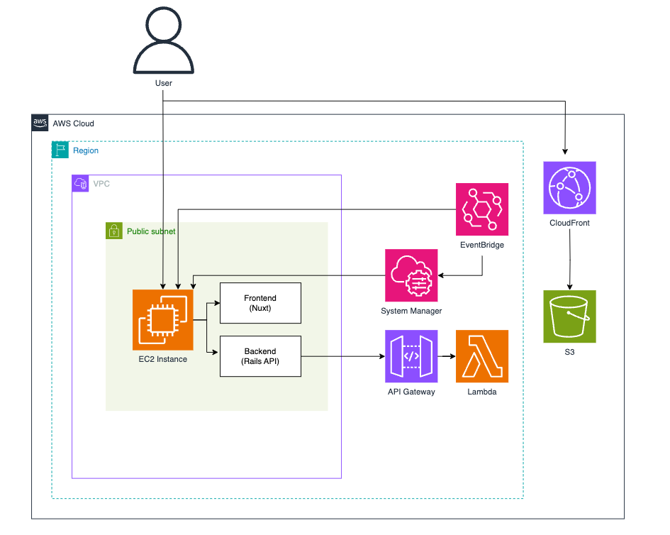

# DisneyCDK

# Infrastructure



## setup

- create .env

`touch .env`

- Inscribe AWS authentication information in the .env file

```
AWS_ACCESS_KEY_ID
AWS_SECRET_ACCESS_KEY
AWS_DEFAULT_REGION
```

-  build docker

`docker-compose build`

-  create cdk project

`docker-compose run --rm cdk cdk init app --language typescript`

- run cdk bootstrap

`docker-compose run --rm cdk cdk bootstrap`

## command

- cdk diff

`docker-compose run --rm cdk cdk diff (CdkStack) --output ./tmp/cdk-out`

- cdk deploy

`docker-compose run --rm cdk cdk deploy (CdkStack --output ./tmp/cdk-out)`

## EC2 Instance
- webアプリケーションサービスを起動
- 内部でnuxtとrailsのdockerを起動

## S3
- アトラクションのサムネイルを保管

## CloudFront
- アトラクションサムネイル用のCDN

## EventBridge
- 以下の定期実行の役割を担う
  - 毎朝9時にEC2インスタンスを自動で起動
  - 毎晩21時にEC2インスタンスを自動で停止
  - 毎朝9時10分にEC2内のdockerコンテナを起動する。コマンドはSystemManagerで管理

## System Manager
- EC2のdockerコンテナを起動するスクリプトを管理している

## API Gateway
- RailsからAPIリクエストを受け取りLambdaに渡す役割

## Lambda
- Pythonでアトラクションの待ち時間をスクレイピング
- JSON形式に加工して返す
- 以下のURLにアクセスするとアトラクション情報が取得できるようになる(クエリパラメータのparkは "sea" か "land"を指定)

`https://r5yd59ix1d.execute-api.ap-northeast-1.amazonaws.com/v1/waittime?park=sea`

```
[{"name": "ソアリン：ファンタスティック・フライト", "condition": "130分"}, {"name": "トイ・ストーリー・マニア！", "condition": "120分"}, {"name": "センター・オブ・ジ・アース", "condition": "100分"}, {"name": "インディージョーンズ", "condition": "85分"}, {"name": "海底2万マイル", "condition": "40分"}, {"name": "ヴェネツィアン・ゴンドラ", "condition": "一時運営中止"}, {"name": "タワー・オブ・テラー", "condition": "85分"}, {"name": "ミッキー&フレンズ･グリーティングトレイル(ミニーマウス)", "condition": "40分"}, {"name": "ニモ＆フレンズ・シーライダー", "condition": "70分"}, {"name": "アクアトピア", "condition": "35分"}, {"name": "シンドバッド・ストーリーブック・ヴォヤッジ", "condition": "20分"}, {"name": "スチーマーライン(メディテ)", "condition": "15分"}, {"name": "レイジングスピリッツ", "condition": "60分"}, {"name": "タートル・トーク", "condition": "60分"}, {"name": "ブローフィッシュ・バルーンレース", "condition": "40分"}, {"name": "ミッキー&フレンズ･グリーティングトレイル(ミッキーマウス)", "condition": "45分"}, {"name": "ワールプール", "condition": "30分"}, {"name": "ジャンピン・ジェリーフィッシュ", "condition": "25分"}, {"name": "フライングフィッシュコースター", "condition": "情報なし"}, {"name": "マジックランプシアター", "condition": "45分"}, {"name": "エレクトリックレールウェイ(ポートディスカバリー)", "condition": "20分"}, {"name": "ジャスミンのフライングカーペット", "condition": "20分"}, {"name": "スカットルのスクーター", "condition": "20分"}, {"name": "スチーマーライン(ロスト)", "condition": "20分"}, {"name": "キャラバンカルーセル", "condition": "10分"}, {"name": "トランジットスチーマーライン(ロストリバーデルタ)", "condition": "25分"}, {"name": "エレクトリックレールウェイ(アメリカンウォーターフロント)", "condition": "25分"}, {"name": "ビッグシティ・ヴィークル", "condition": "10分"}, {"name": "フォートレス・エクスプロレーション", "condition": "5分"}, {"name": "“サルードス・アミーゴス!”グリーティングドック", "condition": "60分"}, {"name": "ディズニーシー･プラザ", "condition": "50分"}, {"name": "ミッキー&フレンズ･グリーティングトレイル(グーフィー)", "condition": "案内終了"}, {"name": "ミッキー＆フレンズ・グリーティングトレイル（ミニー）", "condition": "案内終了"}, {"name": "キャラクターグリーティング（アラビアンコースト）", "condition": "案内終了"}, {"name": "グリーティングトレイル（グーフィー）", "condition": "案内終了"}, {"name": "ヴィレッジ・グリーティングプレイス", "condition": "35分"}, {"name": "アリエルグリーティング", "condition": "案内終了"}, {"name": "アリエルのプレイグラウンド", "condition": "運営中"}, {"name": "マーメイドラグーンシアター", "condition": "休止中（2020/7/1-未定)"}, {"name": "アラビアンコースト", "condition": "案内終了"}, {"name": "ウォーターフロントパーク", "condition": "案内終了"}, {"name": "ミッキー＆フレンズ・グリーティングトレイル（ミッキー）", "condition": "案内終了"}, {"name": "マーメイドラグーンシアター（キャラクターグリーティング）", "condition": "案内終了"}, {"name": "ウォーターフロントパーク（キャラクターグリーティング）", "condition": "情報なし"}, {"name": "ケープコッド・クックオフ横", "condition": "案内終了"}, {"name": "ミッキー＆フレンズ・グリーティングトレイル（ドナルド）", "condition": "案内終了"}, {"name": "ドックサイドステージ（キャラクターグリーティング）", "condition": "案内終了"}, {"name": "ブロードウェイ・ミュージックシアター（キャラクターグリーティング）", "condition": "案内終了"}]
```